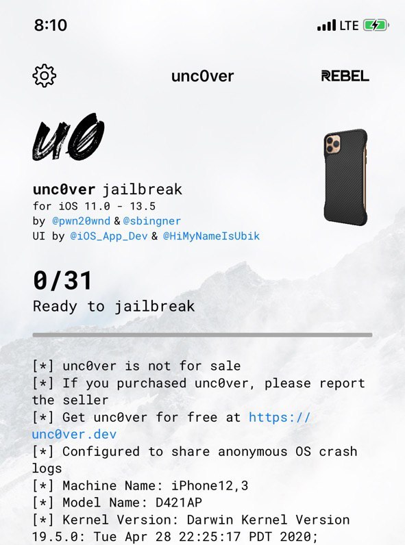

# Awesome Jailbreak
🛠 iOS 탈옥에 사용되는 유용한 정보와 툴, 트윅이 정리된 [Awesome](https://github.com/sindresorhus/awesome) 리스트입니다.

## 탈옥 툴

- **unc0ver**(무료): 커널 취약점을 이용해 아이폰을 탈옥해주는 앱입니다.

## 트윅

### UI

#### 시스템

- **A-Font**(무료): 손쉽게 시스템 폰트를 변경할 수 있습니다.

- **Filza**(무료): 아이폰의 전체 파일시스템에 접근이 가능한 파일 탐색기입니다. 시스템 캐시를 초기화하거나, 기기 및 애플리케이션 설정을 변경할 때 사용할 수 있습니다.

  - **무음 카메라**: `/System/Library/Frameworks/MediaToolox.framework`의 `RegionalSystemSoundsThatShareBehaviour.plist`에서 `J`, `KH` 키를 삭제하고 저장하면 무음 모드에서 셔터음이 들리지 않습니다.

   

- **DayNightSwitch**(무료): iOS 시스템 내 스위치 UI를 모두 해와 달이 그려진 예쁜 스위치로 바꿔줍니다. `Enable Global`을 켜두어야 모든 스위치에 적용됩니다(두 가지 상태를 보여주기 위해서 아래에는 꺼져 있는 스크린샷을 사용했습니다).

#### 상단 상태 바

- **DigitalBattery13**(무료): 배터리 잔량을 퍼센트로 표시해줍니다. 충전 중일 때 번개 아이콘 표시 여부와 상태별 색상, 표시 위치 등을 상세히 설정할 수 있습니다.

 

#### 잠금 화면

- **Axon**(무료): 예전에 존재했던 `Priority Hub`라는 트윅을 개선해, 잠금 화면에 표시되는 각종 알람을 아이콘별로 정리해서 도착 시간 및 알람 개수 등 특정 순서에 맞게 표시해줍니다.

- **ColorMeNotifs**(무료): 앱 브랜드 컬러로 알람의 배경과 테두리 색을 변경하여 보여줍니다. 아래와 같이 오늘 보기 위젯에도 적용됩니다.

 

- **RoundLockScreen**(무료): 잠금 화면의 아래쪽 가장자리를 둥글게 만들어 줍니다.

#### 아이콘

- **dotto+**(무료): 앱 아이콘의 알림 배지를 작은 점 모양으로 간소화해 표시해 줍니다. 채워진 점과 테두리만 있는 점 두 가지 디자인 중 선택할 수 있으며, 배지 배경색 역시 원하는 색 하나로 설정하거나, 앱 자체의 브랜드 컬러에 맞게 표시되도록 할 수 있습니다.

### 탈옥 우회

- **A-Bypass**(무료): 업데이트가 좀 안 되어서 제대로 우회되지 않는데, 아직 무신사나 마카롱택시 같은 앱은 뚫리는 것 같습니다.

- **FlyJB**(무료): 공중제비라고도 불리며, 토스와 카카오톡(카카오페이) 등을 우회할 수 있습니다. 카카오톡의 경우 우회 리스트에 말고도 최적화 리스트에도 추가해야 합니다.

### SNS

### 카카오톡

- **NoMoreDeletedKaTalk**(무료): 상대방이 보낸 삭제된 카카오톡 메세지를 확인할 수 있습니다.

- **NoKaTalkAD**(무료): 카카오톡 광고가 표시되지 않습니다.

